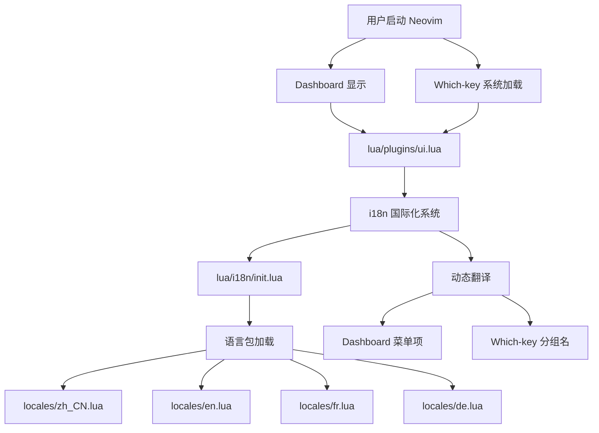
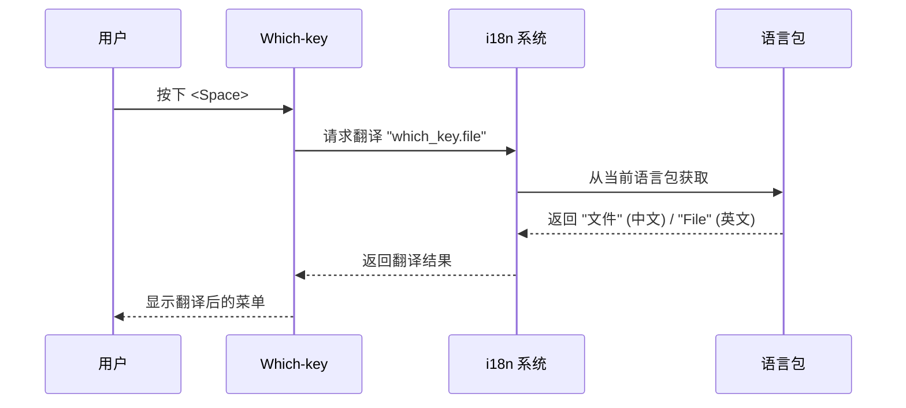

# Which-key 和 Dashboard 详细说明文档

> 📋 完整的 Which-key 菜单系统和 Dashboard 配置指南 | Complete Guide to Which-key Menu System and Dashboard Configuration

---

## � 目录 (Table of Contents)

1. [架构概览](#架构概览)
2. [Dashboard 启动界面](#dashboard-启动界面)
3. [Which-key 菜单系统](#which-key-菜单系统)
4. [多语言支持机制](#多语言支持机制)
5. [配置文件详解](#配置文件详解)
6. [自定义配置示例](#自定义配置示例)
7. [常见问题](#常见问题)
8. [相关资源](#相关资源)

---

## 🏗️ 架构概览

### 系统组件关系



### 文件组织结构

```text
~/.config/nvim/
├── lua/
│   ├── plugins/
│   │   └── ui.lua                 # UI 组件配置（Dashboard + Which-key）
│   ├── i18n/
│   │   ├── init.lua               # i18n 核心系统
│   │   └── locales/               # 语言包
│   │       ├── en.lua             # 英语
│   │       ├── zh_CN.lua          # 简体中文
│   │       ├── fr.lua             # 法语
│   │       └── de.lua             # 德语
│   ├── config/
│   │   └── lazy.lua               # Which-key 分组注册
│   └── utils/
│       └── telescope_lang_picker.lua  # 语言切换选择器
└── docs/
    └── WHICH_KEY_AND_DASHBOARD.md # 用户文档
```

---

## 🎯 Dashboard 启动界面

### 1. Dashboard 是什么？

Dashboard 是 Neovim 启动时显示的欢迎界面，提供快速访问常用功能的入口。本配置使用 `dashboard-nvim` 插件，集成了多语言支持。

### 2. Dashboard 配置详解

#### 配置文件位置

[`lua/plugins/ui.lua`](file:///home/yyt/Downloads/lazyvim-linux/lua/plugins/ui.lua#L233-L307)

#### 核心配置结构

```lua
{
  "nvimdev/dashboard-nvim",
  event = "VimEnter",  -- 💡 Neovim 启动时加载
  opts = function()
    -- ASCII Logo
    local logo = [[...]]
    
    -- 💡 加载 i18n 多语言支持
    local i18n = require("i18n")
    
    return {
      theme = "doom",  -- 使用 doom 主题风格
      config = {
        header = vim.split(logo, "\n"),  -- ASCII 艺术 Logo
        center = {
          -- 菜单项使用 i18n.t() 实现多语言
          {
            action = "Telescope find_files",
            desc = " " .. i18n.t("dashboard.find_file"),
            icon = " ",
            key = "f",
          },
          -- ... 更多菜单项
        },
        footer = function()
          -- 💡 动态显示插件加载统计
          local stats = require("lazy").stats()
          return { i18n.t("dashboard.loaded_plugins", {
            loaded = stats.loaded,
            count = stats.count,
            ms = math.floor(stats.startuptime * 100) / 100
          }) }
        end,
      },
    }
  end,
}
```

### 3. Dashboard 菜单项详解

| 快捷键 | 图标 | 中文描述 | 英文描述 | 触发操作 | 说明 |
|:------:|:----:|:--------|:---------|:--------|:-----|
| `f` | 🔍 | 查找文件 | Find file | `Telescope find_files` | 使用模糊搜索查找项目文件 |
| `n` | 📄 | 新建文件 | New file | `ene \| startinsert` | 创建空白文件并进入插入模式 |
| `r` | 🕒 | 最近文件 | Recent files | `Telescope oldfiles` | 列出最近打开的文件历史 |
| `g` | 🔎 | 查找文本 | Find text | `Telescope live_grep` | 在项目中全局搜索文本内容 |
| `l` | 💤 | 插件管理 | Lazy | `Lazy` | 打开 Lazy.nvim 插件管理器 |
| `q` | 🚪 | 退出 | Quit | `qa` | 退出 Neovim |

### 4. Dashboard 底部状态

底部显示插件加载信息，根据当前语言自动翻译：

```lua
-- 中文语言包 (lua/i18n/locales/zh_CN.lua)
loaded_plugins = "⚡ Neovim 已加载 {loaded}/{count} 个插件，耗时 {ms}ms"

-- 英文语言包 (lua/i18n/locales/en.lua)
loaded_plugins = "⚡ Neovim loaded {loaded}/{count} plugins in {ms}ms"
```

**参数替换机制**：i18n 系统会自动将 `{loaded}`, `{count}`, `{ms}` 替换为实际数值。

---

## ⌨️ Which-key 菜单系统

### 1. Which-key 是什么？

Which-key 是一个快捷键提示系统。当你按下 `<Space>` (Leader 键) 后暂停 500ms，会弹出一个浮动窗口，显示所有可用的快捷键组合及其功能说明。

### 2. Which-key 配置详解

#### 插件配置

[`lua/plugins/ui.lua`](file:///home/yyt/Downloads/lazyvim-linux/lua/plugins/ui.lua#L313-L333)

```lua
{
  "folke/which-key.nvim",
  event = "VeryLazy",  -- 💡 延迟加载，提升启动速度
  opts = {
    preset = "modern",  -- 可选: classic, modern, helix
    
    win = {
      border = "rounded",      -- 圆角边框
      padding = { 1, 2 },      -- 内边距 [上下, 左右]
    },
    
    layout = {
      height = { min = 4, max = 25 },  -- 窗口高度范围
      width = { min = 20, max = 50 },  -- 窗口宽度范围
      spacing = 3,                     -- 列间距
      align = "left",                  -- 左对齐
    },
    
    delay = 500,  -- 💡 延迟 500ms 后显示提示
  },
}
```

### 3. 完整快捷键层次结构

#### 第一层：主分组 (`<Space>`)

| 按键 | 英文 | 中文 | 法语 | 德语 | 说明 |
|:----:|:-----|:-----|:-----|:-----|:-----|
| `f` | File | 文件 | Fichier | Datei | 文件操作 |
| `s` | Search | 搜索 | Rechercher | Suchen | 搜索功能 |
| `g` | Git | Git | Git | Git | Git 版本控制 |
| `c` | Code | 代码 | Code | Code | 代码操作 |
| `d` | Debug | 调试 | Débogage | Debuggen | 调试功能 |
| `b` | Buffer | 缓冲区 | Tampon | Puffer | 缓冲区管理 |
| `w` | Window | 窗口 | Fenêtre | Fenster | 窗口操作 |
| `u` | UI | 界面 | Interface | Benutzeroberfläche | 界面设置 |
| `p` | Python | Python | Python | Python | Python 开发 |
| `r` | Rust | Rust | Rust | Rust | Rust 开发 |
| `l` | LaTeX | LaTeX | LaTeX | LaTeX | LaTeX 写作 |
| `m` | Markdown | Markdown | Markdown | Markdown | Markdown 编辑 |
| `t` | Terminal | 终端 | Terminal | Terminal | 终端操作 |
| `q` | Quit | 退出 | Quitter | Beenden | 退出程序 |

#### 第二层示例：文件操作 (`<Space>f`)

| 快捷键 | 功能 | 说明 |
|:------:|:-----|:-----|
| `<Space>ff` | 查找文件 | 在项目中搜索文件 |
| `<Space>fr` | 最近文件 | 显示最近打开的文件 |
| `<Space>fn` | 新建文件 | 创建新文件 |
| `<Space>fs` | 另存为 | 将当前文件另存为 |
| `<Space>fp` | 预览文件 | 预览当前文件（PDF/图片/视频） |
| `<Space>fo` | 文件管理器 | 在系统文件管理器中打开 |
| `<Space>fy` | Yazi | 打开 Yazi 终端文件管理器 |

### 4. 多语言支持说明

**✅ 完全支持多语言的部分**（我们自定义的分组）：

按下 `<Space>uL` 切换语言后，以下分组名称会立即更新：

- 文件 (File/Fichier/Datei)
- 搜索 (Search/Rechercher/Suchen)
- Git
- 代码 (Code)
- 调试 (Debug/Débogage/Debuggen)
- 缓冲区 (Buffer/Tampon/Puffer)
- 窗口 (Window/Fenêtre/Fenster)
- 界面 (UI/Interface/Benutzeroberfläche)
- Python
- Rust
- LaTeX
- Markdown
- 终端 (Terminal)
- 退出 (Quit/Quitter/Beenden)

**❌ 保持英文的部分**（LazyVim/Snacks 核心）：

以下快捷键来自 LazyVim 框架或 Snacks 插件，无法翻译：

- Explorer Snacks (root dir) - Snacks 文件浏览器
- LazyVim Changelog - LazyVim 更新日志
- Buffers - 缓冲区列表
- Notifications - 通知历史
- Toggle Scratch Buffer - 临时缓冲区

**原因**：这些功能是在 `~/.local/share/nvim/lazy/` 目录下硬编码的，不在我们的配置文件控制范围内。

---

## 🌍 多语言支持机制

### 1. i18n 系统工作流程



### 2. 核心翻译函数

[`lua/i18n/init.lua`](file:///home/yyt/Downloads/lazyvim-linux/lua/i18n/init.lua#L147-L163)

```lua
-- 💡 翻译函数：支持嵌套键和参数替换
function M.t(key, params)
  local value = get_nested_value(M.translations, key)
  
  -- 找不到翻译时返回标记
  if value == nil then
    return string.format("[Missing: %s]", key)
  end
  
  -- 参数替换：例如 "已加载 {count} 个插件"
  if type(value) == "string" and params then
    for k, v in pairs(params) do
      value = value:gsub("{" .. k .. "}", tostring(v))
    end
  end
  
  return value
end
```

### 3. 语言切换方式

#### 方式一：Telescope 选择器（推荐）

```vim
" 快捷键
<Space>uL

" 弹出 Telescope 选择器，用方向键选择语言后按回车
```

#### 方式二：命令模式

```vim
:LangList           " 列出所有可用语言
:LangSwitch zh_CN   " 切换到简体中文
:LangSwitch en      " 切换到英语
:LangSwitch fr      " 切换到法语
:LangSwitch de      " 切换到德语
```

#### 语言持久化

切换后的语言会保存到 `~/.local/share/nvim/language.txt`，下次启动时自动加载。

---

## ⚙️ 配置文件详解

### 1. UI 组件配置

[`lua/plugins/ui.lua`](file:///home/yyt/Downloads/lazyvim-linux/lua/plugins/ui.lua) 包含以下组件：

| 组件 | 插件 | 功能 | 配置行号 |
|:-----|:-----|:-----|:--------|
| Statusline | lualine.nvim | 状态栏 | L14-L71 |
| Bufferline | bufferline.nvim | 缓冲区标签 | L77-L125 |
| Indent Guides | indent-blankline.nvim | 缩进线 | L131-L162 |
| Notifications | nvim-notify | 通知系统 | L168-L196 |
| Command UI | noice.nvim | 命令行美化 | L202-L227 |
| **Dashboard** | dashboard-nvim | **启动界面** | **L233-L307** |
| **Which-key** | which-key.nvim | **快捷键提示** | **L313-L333** |

### 2. i18n 核心模块

[`lua/i18n/init.lua`](file:///home/yyt/Downloads/lazyvim-linux/lua/i18n/init.lua) 关键函数：

| 函数 | 功能 | 行号 |
|:-----|:-----|:-----|
| `M.t(key, params)` | 翻译函数（支持参数替换） | L147-L163 |
| `M.load_language(code)` | 加载指定语言包 | L76-L110 |
| `M.switch_language(new_lang)` | 切换语言并刷新 UI | L175-L206 |
| `M.refresh_which_key_groups()` | 刷新 Which-key 分组名称 | L225-L248 |
| `M.setup()` | 初始化 i18n 系统 | L255-L264 |

### 3. 语言包结构

示例：[`lua/i18n/locales/zh_CN.lua`](file:///home/yyt/Downloads/lazyvim-linux/lua/i18n/locales/zh_CN.lua)

```lua
local M = {}

-- Which-key 分组名称
M.which_key = {
  file = "文件",
  search = "搜索",
  git = "Git",
  code = "代码",
  -- ...
}

-- Dashboard 启动界面
M.dashboard = {
  find_file = "查找文件",
  new_file = "新建文件",
  -- 💡 支持参数替换
  loaded_plugins = "⚡ Neovim 已加载 {loaded}/{count} 个插件，耗时 {ms}ms",
}

return M
```

---

## 🛠️ 自定义配置示例

### 示例 1：添加 Dashboard 菜单项

编辑 [`lua/plugins/ui.lua`](file:///home/yyt/Downloads/lazyvim-linux/lua/plugins/ui.lua#L259-L296)：

```lua
center = {
  -- ... 现有菜单项
  
  -- 添加新菜单项
  {
    action = "Telescope projects",      -- 自定义操作
    desc = " " .. i18n.t("dashboard.projects"),  -- 描述
    icon = " ",                          -- 图标
    key = "p",                           -- 快捷键
  },
}
```

然后在所有语言包中添加翻译：

```lua
-- lua/i18n/locales/zh_CN.lua
M.dashboard.projects = "项目列表"

-- lua/i18n/locales/en.lua
M.dashboard.projects = "Projects"
```

### 示例 2：自定义 Which-key 分组

#### 步骤 1：注册分组

编辑 [`lua/config/lazy.lua`](file:///home/yyt/Downloads/lazyvim-linux/lua/config/lazy.lua)：

```lua
wk.add({
  -- ... 现有分组
  { "<leader>x", group = i18n.t("which_key.custom") },  -- 新分组
})
```

#### 步骤 2：添加翻译

```lua
-- lua/i18n/locales/zh_CN.lua
M.which_key.custom = "自定义"

-- lua/i18n/locales/en.lua
M.which_key.custom = "Custom"
```

#### 步骤 3：添加快捷键

```lua
-- lua/config/keymaps.lua
vim.keymap.set("n", "<leader>xh", ":echo 'Hello'<cr>", { desc = "Say Hello" })
```

### 示例 3：修改 Which-key 窗口样式

编辑 [`lua/plugins/ui.lua`](file:///home/yyt/Downloads/lazyvim-linux/lua/plugins/ui.lua#L316-L332)：

```lua
opts = {
  preset = "helix",  -- 改为 helix 风格
  
  win = {
    border = "double",      -- 双线边框
    padding = { 2, 4 },     -- 增加内边距
  },
  
  layout = {
    height = { min = 8, max = 30 },
    width = { min = 30, max = 60 },
    spacing = 5,
    align = "center",       -- 居中对齐
  },
  
  delay = 300,  -- 减少延迟到 300ms
}
```

### 示例 4：添加新语言支持

#### 步骤 1：创建语言包

```bash
cd ~/.config/nvim/lua/i18n/locales/
cp en.lua ja.lua  # 创建日语语言包
```

#### 步骤 2：翻译内容

```lua
-- lua/i18n/locales/ja.lua
M.which_key = {
  file = "ファイル",
  search = "検索",
  -- ... 全部翻译
}

M.dashboard = {
  loaded_plugins = "⚡ Neovim は {loaded}/{count} プラグインを {ms}ms で読み込みました",
}
```

#### 步骤 3：注册语言

```lua
-- lua/i18n/init.lua
M.supported_languages = {
  en = "English",
  zh_CN = "简体中文",
  fr = "Français",
  de = "Deutsch",
  ja = "日本語",  -- 添加
}
```

---

## ❓ 常见问题

### Q1: 为什么有些 Which-key 条目无法翻译？

**A:** LazyVim 和 Snacks 插件的快捷键是在它们自己的插件目录中硬编码的（位于 `~/.local/share/nvim/lazy/`），不受我们的 i18n 系统控制。只有在我们自己的配置文件中定义的快捷键才能翻译。

### Q2: Dashboard 语言切换后需要重启吗？

**A:** 是的。Dashboard 只在 Neovim 启动时加载一次（`event = "VimEnter"`），因此需要重启才能看到翻译后的启动界面。但 Which-key 的分组名称会立即更新。

### Q3: 如何禁用 Dashboard？

永久禁用：

```lua
-- lua/plugins/ui.lua
{
  "nvimdev/dashboard-nvim",
  enabled = false,  -- 添加此行
}
```

### Q4: Which-key 延迟太长/太短怎么办？

调整延迟时间：

```lua
-- lua/plugins/ui.lua
opts = {
  delay = 200,  -- 改为 200ms（默认 500ms）
}
```

### Q5: 如何查看当前使用的语言？

```vim
:lua print(require("i18n").get_current_language())
```

或查看文件内容：

```bash
cat ~/.local/share/nvim/language.txt
```

### Q6: Dashboard footer 不显示怎么办？

确保 `footer` 函数返回的是表（数组），而不是字符串：

```lua
footer = function()
  local stats = require("lazy").stats()
  local ms = math.floor(stats.startuptime * 100) / 100
  return { i18n.t("dashboard.loaded_plugins", { ... }) }  -- 注意外层的 {}
end
```

### Q7: 如何调试翻译键缺失问题？

如果看到 `[Missing: xxx]`，说明翻译键不存在：

1. 检查语言包文件是否有该键
2. 检查键路径是否正确（使用点分隔，如 `"which_key.file"`）
3. 查看控制台错误信息：`:messages`

### Q8: 如何让 Which-key 菜单更宽？

```lua
opts = {
  layout = {
    width = { min = 40, max = 80 },  -- 增加最大宽度
  },
}
```

---

## 📚 相关资源

### 官方文档

- [dashboard-nvim](https://github.com/nvimdev/dashboard-nvim) - Dashboard 插件官方文档
- [which-key.nvim](https://github.com/folke/which-key.nvim) - Which-key 插件官方文档
- [LazyVim](https://lazyvim.github.io/) - LazyVim 框架文档

### 本项目文档

- [README.md](file:///home/yyt/Downloads/lazyvim-linux/README.md) - 项目主文档
- [I18N.md](file:///home/yyt/Downloads/lazyvim-linux/docs/I18N.md) - 多语言系统使用指南
- [KEYBINDINGS.md](file:///home/yyt/Downloads/lazyvim-linux/docs/KEYBINDINGS.md) - 完整快捷键列表
- [THEMES.md](file:///home/yyt/Downloads/lazyvim-linux/docs/THEMES.md) - 主题配置指南

### 配置文件

- [lua/plugins/ui.lua](file:///home/yyt/Downloads/lazyvim-linux/lua/plugins/ui.lua) - UI 组件配置
- [lua/i18n/init.lua](file:///home/yyt/Downloads/lazyvim-linux/lua/i18n/init.lua) - i18n 核心系统
- [lua/config/lazy.lua](file:///home/yyt/Downloads/lazyvim-linux/lua/config/lazy.lua) - Lazy 和 Which-key 配置

---

**最后更新**: 2026-01-23  
**维护者**: SMLYFM <yytcjx@gmail.com>
